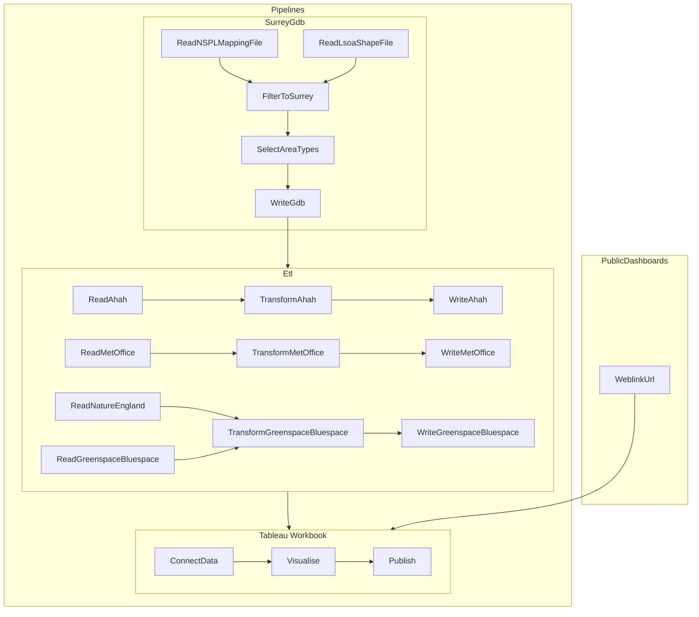

# 📌 Business Use Case
This codebase acts as the central data transformation engine for the climate and envionment JSNA Dashboards. It ingests raw source data, applies transformation logic, and outputs structured datasets. These datasets feed a network of specialized dashboards that ultimately roll up into a single, Central Dashboard.

# 👥 Key Stakeholders
* **JSNA Project Team**: 
  
  [📧](mailto:david.greenwood@surreycc.gov.uk)  David Greenwood - Lead Author (Healthy and Thriving Places)

  [📧](mailto:Jane.Soothill@surreycc.gov.uk) Jane Soothill - Senior Public Health Lead (Environmental Determinants)

  [📧](mailto:Rebecca.Matthews@surreycc.gov.uk) Rebecca Matthews - JSNA Program Manager (Public Health Intelingence Team)

  [📧](mailto:Russ.Bourner@surreycc.gov.uk) Russ Bourner - Senior Population Insight Lead
* **Technical Lead**: 
  
   *until 14/07/2026* 

  [📧](mailto:neil.molkenthin@surreycc.gov.uk) Neil Molkenthin - Advanced Public Health Inteligenct Specialist:
  
   *following 14/07/2026*

   TBC

* **Primary Users**: 
  
  [📧](mailto:HDRCSurrey@surreycc.gov.uk) [Health Deteminants Research Colaborative](https://www.surreyi.gov.uk/hdrc-surrey/) expressed an interest in the dashboard to support data required for research funding


* **Data Providers**:
  
  This dashboard Contains public sector information licensed under the [Open Government Licence v3.0](LICENSE.md).


# 💾 Core Datasets
Upstream (Inputs)[Dataset Name 1]: Raw transaction logs fetched daily via API from 
[Source Name].[Dataset Name 2]: Weekly user metadata snapshots exported from [Source Name] database.
Downstream (Outputs)[Table Name 1]: Aggregated financial metrics used by the Finance Dashboard.
[Table Name 2]: Cleaned user engagement metrics used by the Product Dashboard.[Central Summary Table]: High-level KPIs combined from all sub-tables to feed the Central Dashboard.

# 🏗️ Architecture & Data Flow
Each dashboard is packaged as its own workspace with it's own dashboard included in version control. This enables each dashboard to be updated only if and when required. Separate dashboards for each module are published to tableau public and then integrated within the central dachboard as embedded pages.





# 🛠️ Technology Stack & Dependencies
Language: Python 3.11+
Data Transformation: geopandas / pandas / polars
Storage: Local gdb and csv files

# 🚀 Getting Started for Developers
1. Prerequisites

   Ensure you have Python installed and access keys for the upstream data sources.
2. Environment Setup

   Clone the repository and install dependencies:
    ```bash
    git clone https://github.com/Surrey-County-Council/jsna-climate-and-environment.git
    pip install uv
    uv sync
    uv run main
    ```
3. Environment Variables
   the only supported environment variable is OUTPUT_DIR. setting this lets you save the data somewhere specific. If unset data will be saved in the project directory.

   support for a .env file is provided

   ```bash
   touch .env
   echo OUTPUT_DIR=path/to/data/folder > .env
   ```

   this makes a new file called `.env` and adds the text to that file.

   ```bash
   export OUTPUT_DIR=path/to/data/folder
   ```

   this sets the env variable for your current session.
4. Running the Pipeline

    it is reccommended to run the pipeline with uv

    the project setup sepperates each transformation into a module. In each module a a function named get_data which accepts an output path and a parameter for overwriting cached data. If overwrite is true, all the data is re-run, otherwise the transformation only runs for data that has not been processed. This is important to note if you are making code changes, you should ensure you overwrite the data.

    running the sepperate module as scripts is reccommended for changes affectiong only one module.

    the pyproject.toml spec is used to define dependencies.

# Modules

geography - connects to 2 different arcgis api endpoints. useful for downloading nspl, boundary files and met office datasets. see function doccumentation if you wish to use these for analysis.

datasets - each module contains transformation functions for a single dataset. see function doccumentation if you wish to use these for analysis.

embed_links - the README.md file here explains how to embed external dashboards

for development purposes, jupyter notebooks can be setup and have been stored at the root of the project. These are used for experimentation and have been left present for the time being but should not be seen as working application code.